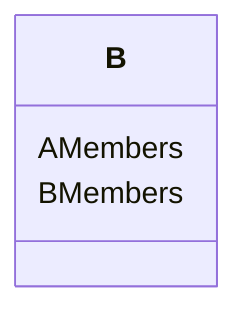

# Inheritance ( 상속 )

## 상속의 형태

```cpp
class A {}

class B : public A 
{}
```

## 상속?

상속을 받게되면, 예를 들어 위의 예시에서 A 클래스의 모든 멤버를 B 클래스가 상속받게 됩니다.



이런 형식으로 B 클래스는 A의 멤버들과 B의 멤버를 가지고있는 구조가 됩니다.

### 그럼 A의 초기화는?

B는 A를 상속 받았기 때문에 A의 초기화 역시 책임져야 합니다. 그래서 B는 A의 생성자를 호출하는 방식으로 초기화를 진행하는 것이 가장 좋습니다.

### A의 private 멤버?

B는 A의 private 멤버를 상속은 받지만, 직접적으로 접근할 수 없습니다.
