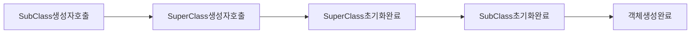

# Inheritance ( 상속 )

## 상속의 형태

```cpp
class A {}

class B : public A 
{}
```

## 상속?

상속을 받게되면, 예를 들어 위의 예시에서 A 클래스의 모든 멤버를 B 클래스가 상속받게 됩니다.


이런 형식으로 B 클래스는 A의 멤버들과 B의 멤버를 가지고있는 구조가 됩니다.

### 그럼 A의 초기화는?

B는 A를 상속 받았기 때문에 A의 초기화 역시 책임져야 합니다. 그래서 B는 A의 생성자를 호출하는 방식으로 초기화를 진행하는 것이 가장 좋습니다.

### A의 private 멤버?

B는 A의 private 멤버를 상속은 받지만, 직접적으로 접근할 수 없습니다.

## SubClass 의 객체 생성 소멸 과정

### 생성

어떤 서브클래스가 생성될때 제일 처음으로 해당 서브클래스의 생성자를 호출합니다. 그 다음, 어떤 슈퍼 클래스의 생성자를 무조건 호출합니다.
만약에 슈퍼클래스의 어떤 생성자를 호출할지 명시하지 않았다면, 슈퍼클래스의 void 생성자를 호출합니다.

그래서 전반적인 순서는



정리하면 SubClass의 생성자를 호출하는데, 이때 SuperClass를 상속받는다는 사실을 알고, SuperClass의 생성자를 호출합니다. 그리고 SuperClass의 초기화를 끝내고 돌아와서 SubClass의 생성자를 이어서 실행하여, SubClass의 초기화를 진행합니다. 그러면 객체가 완성됩니다.

중요한건 슈퍼클래스와 서브클래스의 생성자가 **모두** 호출된다는 사실이고, **클래스의 멤버는 해당 클래스의 생성자를 통해서 초기화해야 한다** 라는 원칙을 꼭 기억해야 합니다.

### 소멸

소멸 과정은 생성 과정과 비슷하지만, 순서가 반대입니다. 생성이 슈퍼클래스 초기화 -> 서브클래스 초기화 였다면, 소멸시에는 슈퍼클래스의 deconstructor를 먼저 실행하고, 서브클래스의 deconstructor를 실행하는 순서입니다.

여기서 또 중요한것은 결국 Deconstructor는 슈퍼클래스, 서브클래스 **모두** 호출된다는 사실이고, 이에 따라서 **Constructor에서 동적 할당한 메모리 공간은 해당 Deconstructor에서 해제를 진행해준다.** 라는 원칙을 기억해야합니다.
