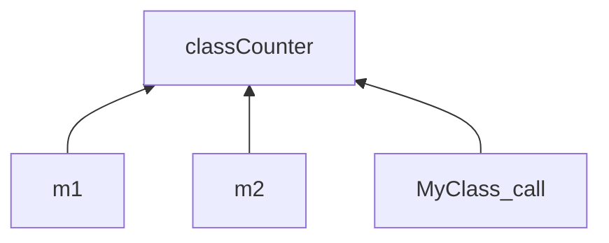

# Static in C++

## static in C

### 전역변수에 붙은 static

선언된 파일 내에서만 참조를 허용한다는 의미로 사용했습니다.

```cpp
#include <iostream>

static int globalVar = 0;

int main(void)
{
  // ...
}
```

### 함수 내에 선언된 static

*한번만* 초기화되고, 지역변수와 달리 함수가 끝나도 소멸되지 않고 살아남아 있습니다.

```cpp
void SomeFunction()
{
  static int counter = 0;
  // ...
}
```

## static in C++

## static 멤버 변수 (클래스 변수)

어떤 클래스에서 멤버 변수를 `static`을 붙여서 선언하면, 일반 멤버 변수와는 다르게 이 멤버 변수는 *클래스당 하나*만 생성됩니다. 즉, *클래스 자체가* 가지고 있는 변수라 '클래스 변수' 라고도 합니다.

```cpp
class MyClass
{
private:
  static int classCounter;

public:
  MyClass()
  {
    classCounter++;
    cout << classCounter << " MyClass ! " << endl;
  }
};
```

위의 코드에서 classCounter 라는 static 멤버 변수를 선언해주었습니다. 그리고 클래스가 생성될 때마다 이 Couter를 1씩 증가시켜주었습니다.

```cpp
int MyClass::classCounter = 0;

int main(void)
{
  MyClass m1;
  MyClass m2;

  MyClass();

  return 0;
}
```

초기화를 해주고 m1, m2를 생성하고, MyClass()를 호출하면

```markdown
1 MyClass ! 
2 MyClass !
3 MyClass !
```

라는 결과가 나옵니다. 마치 classCounter라는 전역변수를 두고, 카운터를 증가시킨것과 똑같은 결과를 만들어줍니다!



## static 멤버 함수
