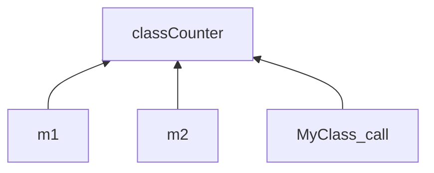

# Static in C++

## static in C

### 전역변수에 붙은 static

선언된 파일 내에서만 참조를 허용한다는 의미로 사용했습니다.

```cpp
#include <iostream>

static int globalVar = 0;

int main(void)
{
  // ...
}
```

### 함수 내에 선언된 static

*한번만* 초기화되고, 지역변수와 달리 함수가 끝나도 소멸되지 않고 살아남아 있습니다.

```cpp
void SomeFunction()
{
  static int counter = 0;
  // ...
}
```

## static in C++

## static 멤버 변수 (클래스 변수)

어떤 클래스에서 멤버 변수를 `static`을 붙여서 선언하면, 일반 멤버 변수와는 다르게 이 멤버 변수는 *클래스당 하나*만 생성됩니다. 즉, *클래스 자체가* 가지고 있는 변수라 '클래스 변수' 라고도 합니다.

```cpp
class MyClass
{
private:
  static int classCounter;

public:
  MyClass()
  {
    classCounter++;
    cout << classCounter << " MyClass ! " << endl;
  }
};
```

위의 코드에서 classCounter 라는 static 멤버 변수를 선언해주었습니다. 그리고 클래스가 생성될 때마다 이 Couter를 1씩 증가시켜주었습니다.

```cpp
int MyClass::classCounter = 0;

int main(void)
{
  MyClass m1;
  MyClass m2;

  MyClass();

  return 0;
}
```

초기화를 해주고 m1, m2를 생성하고, MyClass()를 호출하면

```markdown
1 MyClass ! 
2 MyClass !
3 MyClass !
```

라는 결과가 나옵니다. 마치 classCounter라는 전역변수를 두고, 카운터를 증가시킨것과 똑같은 결과를 만들어줍니다!



이런식으로 전역변수 대신 `static` 키워드를 사용하면 위에서 classCounter를 선언한 방식 처럼 접근제한자를 사용하여 classCounter라는 변수에 대한 접근을 막아줄 수 있다는 장점이 있습니다.

그리고 `public` 으로 선언된 static 멤버 변수의 경우에는 똑같지만, 외부에서 접근이 가능한 부분인데. 생성된 객체 즉, classCounter가 public이라 가정하면 `m1::classCounter` 로도 접근이 가능하지만, 클래스 변수라는 것을 명확하게 표현하기 위해 `MyClass:classCounter` 이렇게 표현하는 것이 더 의미 전달이 확실합니다.

## static 멤버 함수

static 멤버 함수 역시 static 멤버 변수와 특성이 동일합니다. 특히 static 멤버 함수를 사용할 때 주의해야 할 static의 특성 중 하나가 *객체의 멤버로 존재하는 것이 아니다.* 라는 부분입니다.

```cpp
class MyClass
{
private:
  static int classCounter;
  int someVar = 0;

public:
  // ...

  static void MyFunc()
  {
    someVar++; // error!
    classCounter++;
    return;
  }
};
```

`MyFunc()`을 보면 일반 멤버 변수인 `someVar`에 static 멤버 함수인 MyFunc()에서 접근하려고 하면 에러가 나는 것을 볼 수 있습니다. 즉, MyFunc() 은 MyClass의 멤버로 존재하는것이 아니기 때문에, MyClass의 private 멤버 변수인 someVar에 접근할 수 없습니다.
대신, *static 멤버 함수 내에서는 static 멤버 변수와 static 멤버 함수만이 호출 가능합니다.*

그래서 이 static을 잘 활용하면, 전역 변수, 전역 함수의 사용을 줄일 수 있습니다.

## const static

일반 const 멤버 변수와 const static 멤버 변수의 차이는 초기화 시점에서 차이를 확인할 수 있습니다.
일반 const 멤버 변수의 초기화는 선언할 때가 아닌, 이니셜라이저를 통해 초기화를 해주어야 했습니다. 하지만, const static 멤버 변수는 선언과 동시에 초기화가 가능합니다.

```cpp
class MyClass
{
private:
  // ...
  const static int initializeInteger = 0;
// ...
```

const static 멤버 변수는 어떤 인스턴스가 생성될 때가 아닌, 클래스가 생성될 때 지정된 값이 유지되는 상수이므로, 이러한 초기화를 허용하고 있습니다.

## mutable
