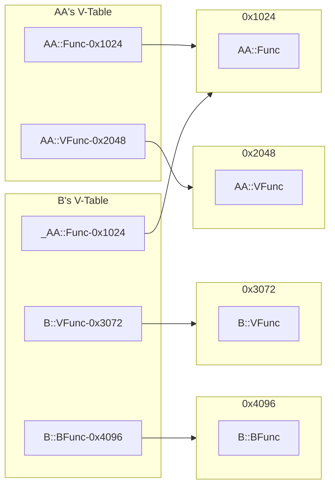

# V-Table

C++와 C의 속도 차이에는 이 'V-Table'이 한몫을 합니다. 바로 이 'virtual'이라는 개념 때문이기도 합니다. virtual_function.md 에서 살펴보았던 가상함수가 어떻게 호출되는지 좀 더 자세하게 살펴보면서 V-Table을 이해해보도록 하겠습니다.

## Example with code

```cpp
class AA
{
public:
  void Func()
  {
    std::cout << "AA::Func() " << std::endl;
  }

  virtual void VFunc()
  {
    std::cout << "AA::VFunc() " << std::endl;
  }
};

class B : public AA
{
public:
  virtual void VFunc()
  {
    std::cout << "BB::VFunc() " << std::endl;
  }

  void BFunc()
  {
    std::cout << "BB::BFunc() " << std::endl;
  }
};
```

위와 같은 코드의 V-Table의 형태는 그림으로 나타낸다면



이렇게 나타낼 수 있습니다.

B클래스는 AA클래스를 상속받았는데, 상속받은 `Func()`의 주소값은 그대로 AA가 가리키고 있는 `Func()`의 주소값을 가리키고 있습니다. 반면에, `virtual`로 선언한 `VFunc()`을 유심히 살펴보면, B에서의 VFunc() 주소와 AA에서의 VFunc() 주소는 다른곳을 가리키고 있고, 즉 업데이트(?) 됐다고 볼 수 있습니다.
그래서 해당 클래스가 만들어질 때, BB의 V-Table은 저것과 같은 형태로 만들어지고, virtual_function 에서 살펴보았던, 포인터 변수의 타입이 아닌 실제 가리키고 있는 객체의 타입에 맞춰 함수가 실행되는 것입니다.
즉, C++은 함수를 호출할 때, V-Table을 참고해서 어떤 함수를 호출하는게 맞는지 판단하는 과정이 생기는것입니다.
그리고 AA의 객체, B의 객체는 각각 객체 내에 vtable을 기리킬 수 있는 포인터를 가지고 객체에 맞는 V-Table을 가리키고 있습니다.
